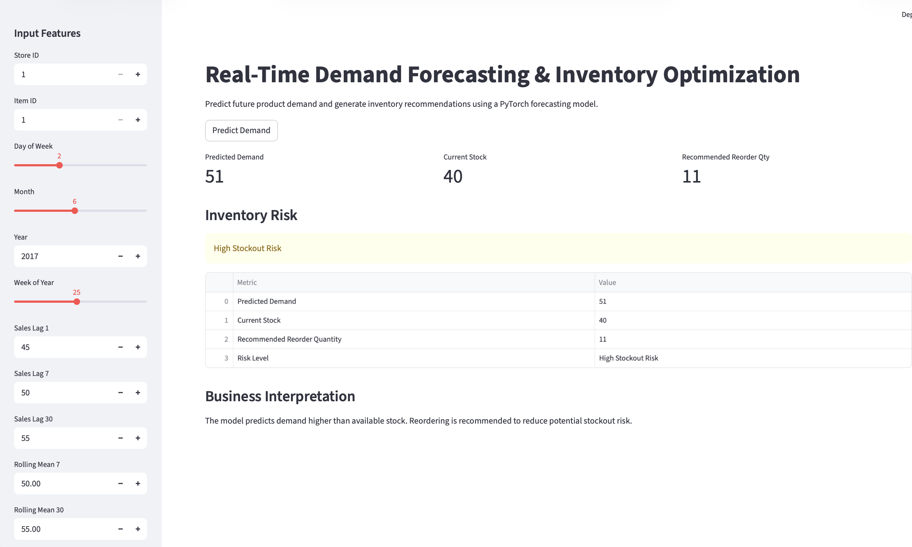

# AI-Powered Demand Forecasting & Inventory Optimization System

A production-style machine learning system built using PyTorch, MLflow, FastAPI, Docker, and Streamlit for retail demand forecasting and inventory optimization.

The system predicts future product demand, identifies stockout risks, and recommends inventory reorder quantities using historical sales patterns and time-series feature engineering.

---

# Tech Stack

- PyTorch
- MLflow
- FastAPI
- Streamlit
- Docker
- Scikit-learn
- Pandas
- NumPy

---

# Key Features

- Retail demand forecasting using PyTorch
- Inventory optimization and stockout risk prediction
- Automated reorder quantity recommendation
- MLflow experiment tracking
- FastAPI inference API
- Streamlit interactive dashboard
- Dockerized deployment pipeline

---

# Streamlit Dashboard

The dashboard allows users to:
- input historical sales features
- predict future demand
- analyze inventory risk
- generate reorder recommendations


---

# API Inference Example

FastAPI endpoint for real-time prediction and inventory optimization.

Example API response:

```json
{
  "predicted_demand": 51,
  "current_stock": 40,
  "stockout_risk": "High Stockout Risk",
  "recommended_reorder_quantity": 11
}

```
## MLflow Experiment Tracking

The project includes:

experiment tracking
training metrics
model logging
reproducible ML workflows

## Run Locally
1. pip install -r requirements.txt
2. uvicorn src.api:app --reload(Run api)
3. streamlit run app/dashboard.py(Run Dashboard)

## Docker
docker build -t demand-forecasting-api .( Build Image),
docker run -p 8000:8000 demand-forecasting-api(Run Container)

## Business Impact
This system helps businesses:

1. improve inventory planning
2. reduce stockout risk
3. optimize reorder decisions
4. forecast future product demand
5. support operational decision making
